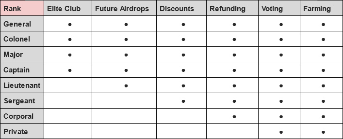

# 6.3 Utilities by rank

## Terminology

### Elite club

### Future Airdrops
You will receive AirDrop tokens from CasperArmy Organization partners and future products built on the Casper Network by CasperArmy Organization

### Discounts

#### At CasperArmy:
- You will receive free or discounted access to tools / products / applications that the CasperArmy Organization will deploy on the Casper Network in the future.
- You will get priority in the queue for access to listed products on the https://www.casper.army/ platform.

#### At CasperArmy's partners:
- You get discounts on products and services from future CasperArmy Organization partners.

### Refunding
Funds collected from the CasperArmy NFT sale will be designated into 2 pots, they are as follows:
1. 30% of sale funds will be directly distributed to the CasperArmy platform development fund.
2. 70% to be staked as a delegator on the CasperArmy node with rewards being used in the following way:
- 50% of will be refunded monthly in CSPR to CasperArmy NFT holders for a period of 36 months (airdrop excludes Private rank members).
- 50% will be reinvested back into the CasperArmy platform to fund
project development and other intended airdrops.

### Voting
The CasperArmyNFT will give you the physical ability to decide on the development of CasperArmy Organization, including future projects and partnerships.

### Farming
Along with the development of CasperArmy Organization products, farming of CasperArmyNFT will be possible.
